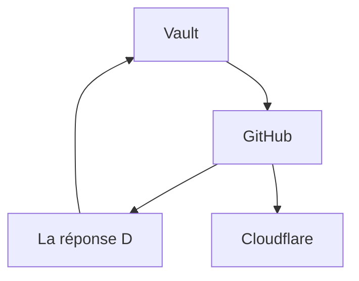

# Titre H1
## Titre H2
### Titre H3
#### Titre H4

---
#### Mise en forme
> Mettre du relief au texte

*italique*  
**gras**  
***gras italique***  
~~barré~~  
`code inline`

---
#### Blocs de code
>Afficher du code ou du texte préformaté
```python
print("Hello Obsidian")
```
---
#### Citations
>Indiquer des citations et des mises en retrait

>Ceci est une citation simple
>> Ceci est une citation imbriquée
>>> Encore plus imbriqué

---
#### Listes à puces
- Puce 1
- Puce 2
  - Sous-puce
#### Listes numérotées
1. Liste ordonnée
2. Élément 2
   3. Sous-élément
---
#### Cases à cocher
- [ ] Tâche à faire
- [x] Tâche terminée
---
#### Tableaux simples
>Présenter des données alignées et ordonnées

| Colonne 1 | Colonne 2 |
|-----------|-----------|
| Valeur A  | Valeur B  |
| Valeur C  | Valeur D  |

---
#### Liens et médias
> Possibilités : 
> 	- Insérer des liens externes et les renommer
> 	- Insérer des liens pour des notes internes

[Texte du lien](https://obsidian.md)
[[Nom de la note interne]]
![[Image.png]]    <-- intègre une image

---
#### Callouts
>Intégrer du texte dans un bloc coloré. 
>Voici la liste complète : 
- **Note** : note
    
- **Résumé** : abstract, summary, tldr
    
- **Info** : info
    
- **À faire** : todo
    
- **Astuce** : tip, hint, important
    
- **Succès** : success, check, done
    
- **Question** : question, help, faq
    
- **Avertissement** : warning, caution, attention
    
- **Échec** : failure, fail, missing
    
- **Danger/Erreur** : danger, error
    
- **Bug** : bug
    
- **Exemple** : example
    
- **Citation** : quote, cite

> [!note] note

> [!info] 

> [!danger] danger

> [!warning] warning

> [!tip] tip

> [!example] exemple

>[!Success] success

>[!Question] question

>[!Failure] failure

>[!bug] bug

>[!quote] citation

---
---
#### Métadonnées
> il faut toujours encadrer par une ligne au dessus et au dessous afin de 

title: Ma note
tags: [obsidian, guide]
created: 2025-08-27

---
#### Emojis
👉 💡 ⚠️ ✅ 🔒 🌐

---
#### Diagrammes Mermaid
>Créer des schémas dans la note




